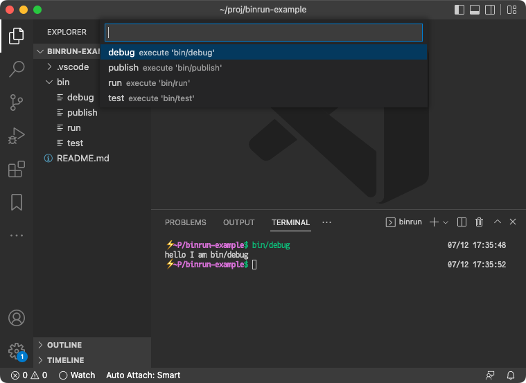

# binrun

*binrun gives you a pick list of scripts in your workspace to execute*



## Features

- Provides a fuzzy pick list to execute scripts in your workspace
- Searches `./bin` (user-configurable)
- Executes the command in the integrated terminal
- Configurable command template

I use the configurable command template to forward the command to [kitty](https://sw.kovidgoyal.net/kitty/) so I can launch commands in my terminal-of-choice.

## Rationale

I got frustrated by the continual cycle of editor &rarr; `alt-tab` to terminal &rarr; `up-arrow` (*n) + `enter` to run/build etc.
One should be able to launch tools from where changes are made with less friction, either a keystroke or two.

Following the "unix philosophy" of having separate tools loosely coupled, this doesn't depend on "task runners" or npm scripts or vscode tasks defined in json files.
With this extension, you can launch any shell script in your workspace, so it works automatically without any dependencies or configuration.

## Installation

```
code --install-extension kbd.binrun
```

Or here is [`kbd.binrun` on the extension marketplace](https://marketplace.visualstudio.com/items?itemName=kbd.binrun).

## Extension Settings

This extension contributes the following settings:

* `binrun.commandTemplate`: a string template for each command
* `binrun.subDirectories`: set to an array of subdirectories to search

## Known Issues

If you change the directory of your terminal away from your workspace it won't be able to run your scripts.

## Todo

- write tests :)
- suggestions?

## Changelog

See [Changelog](./CHANGELOG.md)
